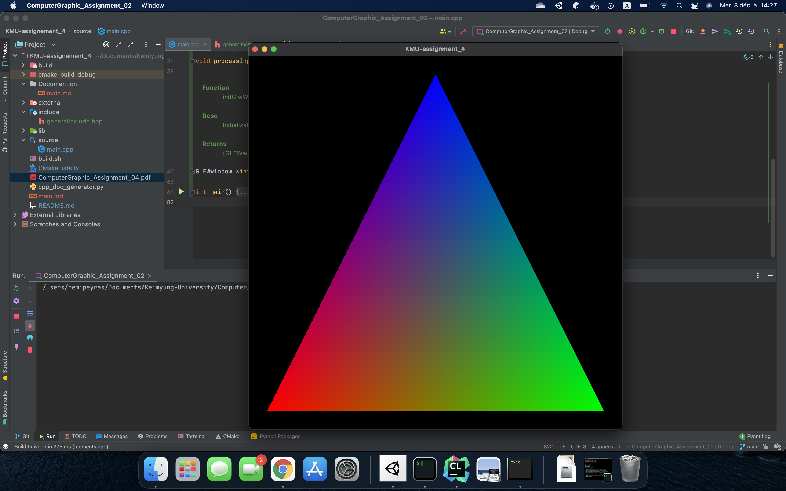

# KMU-assignment_4

Student id : ```7001893 Rémi-Peyras```

Response of all exercise : ```Response_7001893-Rémi-PEYRAS.docx```

Documentation of the project into folder: ```Documentation```

Source of the Code into folder : ```source + include```

## Renderer Of The Assignment



## Mandatory

You need to have :

- Cmake
- make

## How To build the Code

- Create a new folder named : ```build```
- Enter into the folder ```build```
- Do this command : ```cmake ..``` (will generate a configuration to compile the
  code)
- Do this command : ```make``` (compile the code)
- Do this command : ```./ComputerGraphic_Assignment_04``` (will execute the
  code)
